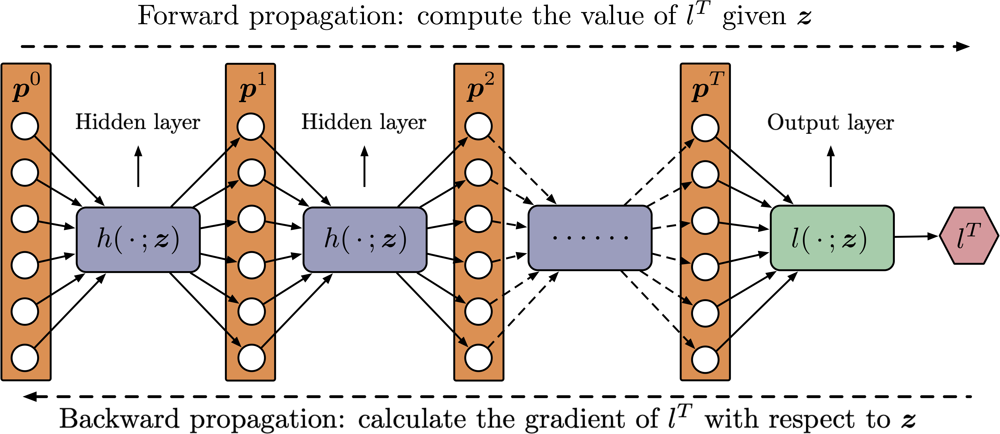

## Differentiable-Bilevel-Programming

This repository contains the source code to reproduce the experiments in our paper, entitled [Differentiable Bilevel Programming for Stackelberg Congestion Game](https://arxiv.org/abs/2209.07618), by Jiayang Li, Jing Yu, Qianni Wang, Boyi Liu, Zhaoran Wang, and Yu (Marco) Nie.

### A Brief Introduction 

A Stackelberg congestion game (SCG) is a bilevel program in which a leader aims to maximize their own gain by anticipating and manipulating the equilibrium state at which followers settle by playing a congestion game. Large-scale SCGs are well known for their intractability and complexity.   In this study,  we attempt to marry the latest developments in machine learning with traditional methodologies — notably bilevel optimization and game theory — to forge an integrative approach based on differentiable programming.  Among other advantages,  the approach enables us to treat the equilibration of a congestion game as a deep neural network (see below), so that a suite of computational tools, notably automatic differentiation, can be easily applied.

If you are interested in learning more about how to apply automatic differentiation to solve SCGs, please have a look at [the arXived version of our paper](https://arxiv.org/abs/2209.07618).

### Setup and Dependencies

(To run the experiments)
- Python >= 3.7: https://www.python.org/downloads/
- numpy >= 1.19: https://numpy.org/install/
- Torch >= 1.10: https://pytorch.org/get-started/locally/ (Important: Please install Torch with CUDA)
- CVXPY >= 1.1: https://www.cvxpy.org/install/index.html
- cvxpylayers >= 0.1: https://github.com/cvxgrp/cvxpylayers

(For visualization)
- matplotlib >= 3.1: https://matplotlib.org/
- NetworkX >= 2.6: https://pypi.org/project/networkx/
- prettytable >= 3.4: https://pypi.org/project/prettytable/

### Before Running the Codes

Plase unzip two files before running the codes:
- Part-2-BP/Network/Grid_50_0.1252_1.edgepath.zip
- Part-3-SCG/Network/chicagosketch.path_edge.pt.zip

### How to Run the Codes

There are three folders in this repository.

- [Part-1-FP](https://github.com/jiayangli-nu/Differentiable-Bilevel-Programming/tree/main/Part-1-FP) includes all the experiments in Section 9.1 (Performance of Forward Propagation (FP) Algorithm)
    - Experiment-A.py
    - Experiment-B.py
- [Part-2-BP](https://github.com/jiayangli-nu/Differentiable-Bilevel-Programming/tree/main/Part-2-BP) includes all the experiments in Section 9.2 (Performance of Backward Propagation (BP) Algorithm)
    - Experiment-C.py
    - Experiment-D.py
    - Experiment-E-1.py and Experiment-E-1.py
- [Part-3-SCG](https://github.com/jiayangli-nu/Differentiable-Bilevel-Programming/tree/main/Part-3-SCG) includes all the experiments in Section 9.3 (Performance of Stackelberg Congestion Game (SCG) Algorithms)
    - Experiment-F.py
    - Experiment-G.py
    - Experiment-H-1.py and Experiment-H-2.py

To run the scripts, please open each folder in your terminal (Linux/MacOS) first and then simply type "python SCRIPTNAME.py" in the terminal to execute the script (Note: "Experiment-H-1.py" must be run before "Experiment-H-2.py").

All the figures in our paper will be plotted and stored in the coresponding folders; all the tables will be directly printed with the package [prettytable](https://pypi.org/project/prettytable/).

### Future Work

This repository temporarily only includes the source codes for reproducing the computational results in our paper. We are looking forward to providing a more detailed instruction document in the future. Please check for any new updates later!

For any questions about the codes or/and the paper, please contact [Jiayang Li](mailto:jiayangli2024@u.northwestern.edu) or [Yu (Marco) Nie](mailto:y-nie@northwestern.edu).
